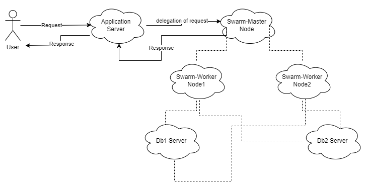
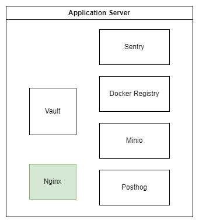
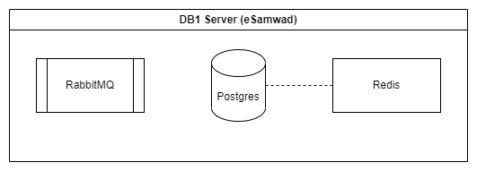
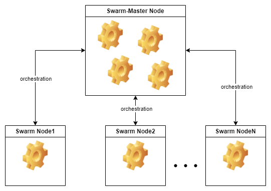

# Infrastructure Overview 📖

As a concrete illustration, let's examine six servers constituting our deployment environment:

| Servers      |
| ------------ |
| application  |
| db1          |
| db2          |
| swarm-master |
| swarm-node2  |
| swarm-node3  |

## Request Flow



When a user initiates a request for a specific service, it first passes through Nginx, which functions as a reverse proxy and routes the request to the corresponding destination. If the request is successfully resolved at the application server, the application server handles the request and sends the response directly to the user.

However, if the request is directed to another service within the swarm network, it is delegated to the swarm-master node. The swarm-master node, in turn, can internally route the request to its worker node, which processes the request and returns the response to the master node. The master node then forwards the response to the application server, which ultimately delivers it back to the user.

## Server Breakdown

### Application Server 📱

> This is where this repo should be cloned.



The **application** server serves as the cornerstone, hosting services that need to be accessible from the external world. It achieves this by exposing specific ports for these services.

#### Services deployed on `application` server

##### [Docker Registry](https://docs.docker.com/registry/)

**Docker Registry** is a stateless, highly scalable server side application that stores and lets you distribute Docker images. We store our Samarth docker images over there.

**Setup Approach:**

We adhered to the instructions outlined in the [Docker Registry documentation](https://docs.docker.com/registry/#basic-commands) for the establishment of our private registry.

##### [Vault](https://developer.hashicorp.com/vault)

Our deployment is heavily dependent on **Vault** that is a service that manages secrets and protect sensitive data. you can think of it as a password manager. We store credentials and `env` variables over there that is needed by the `jenkins` on build or deployment.

**Setup Approach:**

Detailed instructions can be found in the [vault-setup.md](./vault-setup.md) file, guiding the meticulous setup of Vault to support our deployment requirements.

##### [Minio](https://min.io/)

**Minio** is a high performance
object storage like S3 but cab be self-hosted. We use minio for storing and sharing files to the end user.
In this deployment context, we use minio with `doc-generator` service which after creating `pdfs` it stores them or host them on minio.

**Setup Approach:**

The deployment of Minio is orchestrated through the `/home/samarth-devops/docker-compose/minio-compose.yml` file. After this service is up and running, a series of commands using the `minio-client` (`mc`) utility is performed to create and manage buckets, configure permissions, and ensure optimal operation.

Minio-client has alredy been downloaded on this server. But you can download it from [here](https://min.io/docs/minio/linux/reference/minio-mc.html#install-mc).

Next we just need to run few commands.

1. Create an alias

   ```sh
   mc alias set <aliasname> <endpoint> <access_key> <secret key>
   ```

2. Create bucket

   ```sh
   mc mb <aliasname>/doc-generator
   ```

3. Create bucket policy

   ```sh
   mc admin policy create <aliasname> doc-generator /home/samarth-devops/docker-compose/minio-policies/doc-generator.json
   ```

4. Make bucket public so that it can be accessed anonymously

   ```sh
   mc anonymous set download <aliasname>/doc-generator
   ```

5. Restart this service
   ```sh
   docker-compose -f minio-compose.yml restart
   ```

##### [Sentry](https://sentry.io)

Sentry stands as a powerful tool for keeping an eye on how well an application performs and for tracking any errors that might pop up.

We make use of Sentry to monitor the `eSamwad` application, making sure it runs smoothly.

**Setup Approach:**

Getting Sentry up and running is quite straightforward. Just follow these steps:

1. Begin by cloning the repository and navigating into it.

   ```sh
   git clone https://github.com/getsentry/self-hosted.git
   ```

2. Modify the `.env` file to match your configuration needs.

3. Start the service by using `docker-compose`.
   ```sh
   docker-compose up -d
   ```

This will get Sentry running and ready to help keep an eye on your application's performance and errors.

##### [Posthog](https://posthog.com/)

PostHog offers a suite of tools designed to analyze the performance of products within modern enterprises. Notably, it sets itself apart by being open source and encompassing a comprehensive array of functionalities crucial for ensuring a product's success.

Within the context of `Samarth`, we utilize Posthog to gather analytical insights derived from the `eSamwad` application.

**Setup Approach:**

Setting up Posthog is a breeze, enabling you to get it operational within mere minutes.

For comprehensive setup instructions, please refer to the following link: https://github.com/Samagra-Development/posthog-deploy#setup

### db1 Server 💾



The **db1** server takes on the responsibility of housing the persistence layer for the `eSamwad backend`. Importantly, access to this server is restricted to its private IP.

It encompasses the following services:

1. RabbitMQ

   It functions as the backend for the **celery** app, which manages asynchronous tasks within the `eSamwad backend`.

2. Postgres

   Postgres we use store `eSamwad backend` data.

3. Redis

   It is deployed for the purpose of caching, contributing to optimized performance within the system.

All of these have been deployed using `/home/samarth-devops/docker-compose/db-compose-esamwad.yml`.

### db2 Server 💾


The **db2** server plays host to the persistence layer of the cross-cutting services. Like the db1 server, access to db2 is confined to its private IP.

1. ODK-adapter

   - Postgres
   - Redis

2. Doc-generator

   - Postgres
   - RabbitMQ

3. Templater

   - Postgres

4. Yaus

   - Postgres
   - RabbitMQ
   - Redis

5. ODK-aggregate

   - Postgres

6. FusionAuth

   - Postgres
   - Elastic Search

7. Airflow

   - Postgres
   - Redis

All these service's persistence layer has been deployed using `/home/samarth-devops/docker-compose/db-compose.yml`.

### swarm-master Server 🧑‍💼



The **swarm-master** server serves as the core hub for our Docker swarm deployment, acting as the central orchestrator for all deployment processes.

This server operates alongside two subordinate nodes:

1. **swarm-node2**
2. **swarm-node3**

Upon the successful build and deployment of an application via `Jenkins`, the result is pushed to the **swarm-master** server. Subsequently, this central server initiates an intricate deployment process across the swarm, making strategic decisions based on factors such as processing capacity and available memory.

### swarm-node2 🧑‍🏭

The **swarm-node2** node functions as a dedicated worker within the **swarm-master** architecture. It plays a crucial role in collectively contributing to the distributed application deployment process orchestrated by the **swarm-master** server.

### swarm-node3 🧑‍🏭

Similarly, the **swarm-node3** node serves as another dedicated worker within the **swarm-master** architecture. Just like **swarm-node2**, it actively participates in the collective deployment efforts led by the **swarm-master** server.
