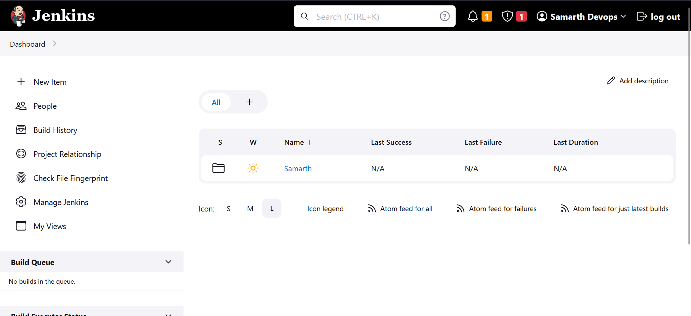
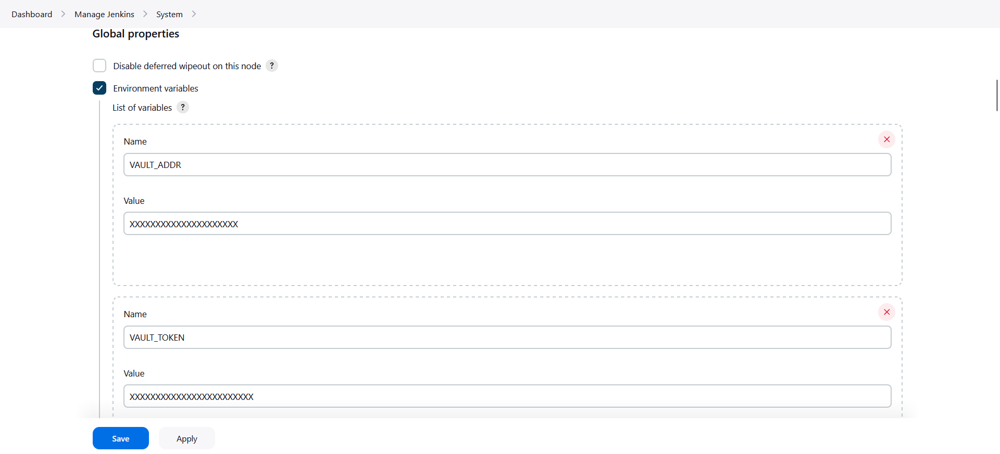
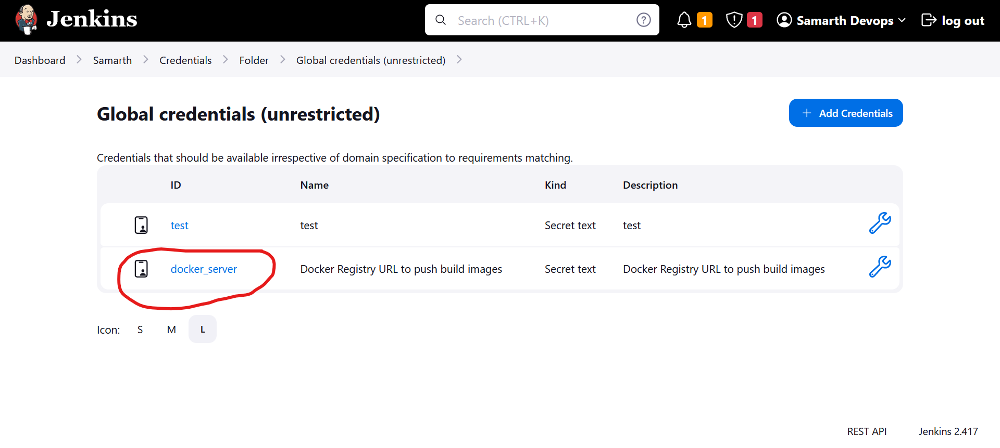
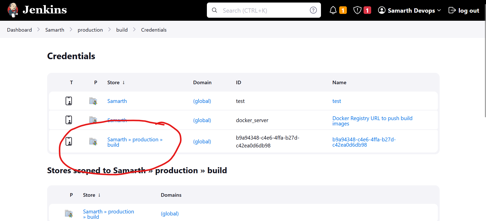
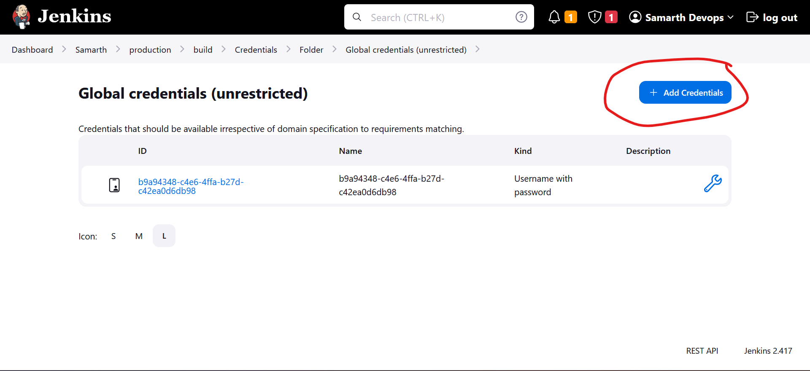
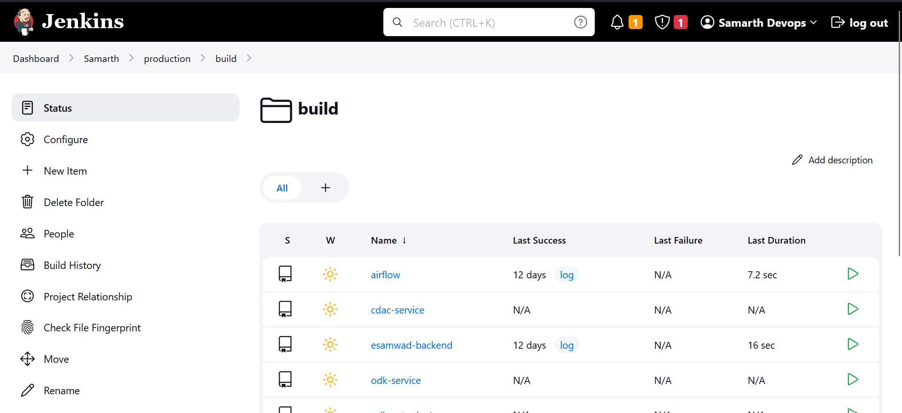
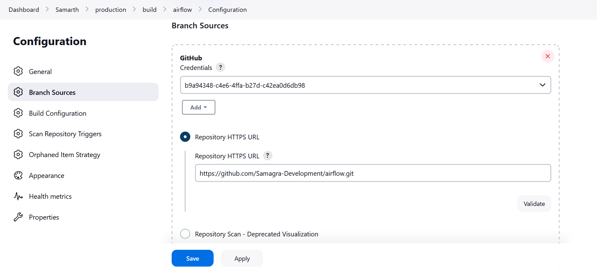
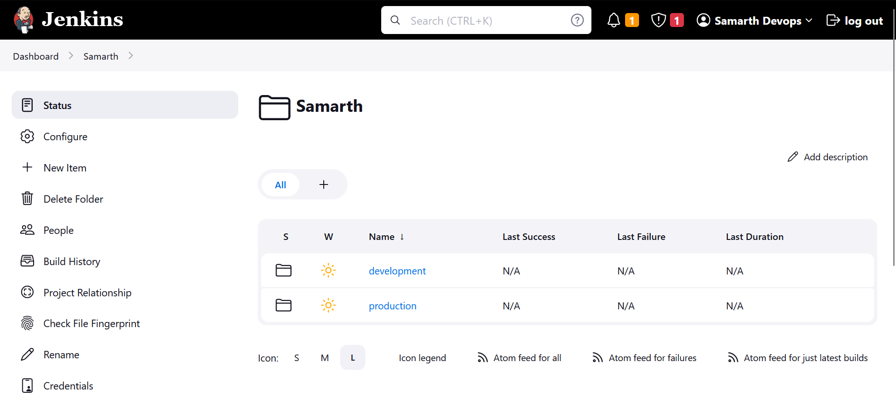
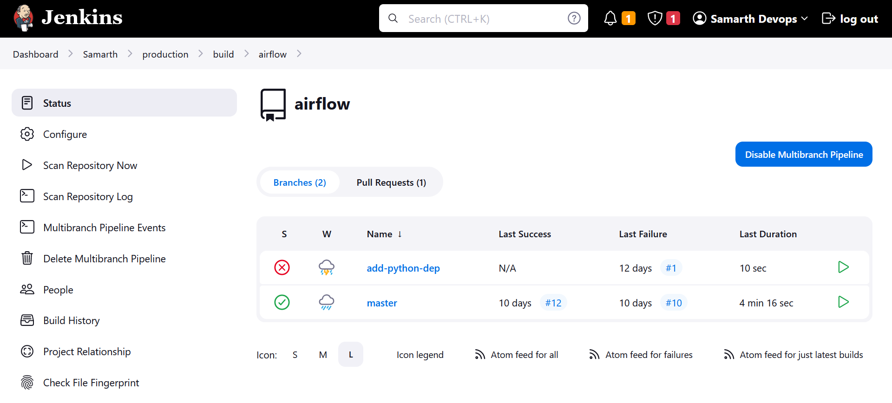
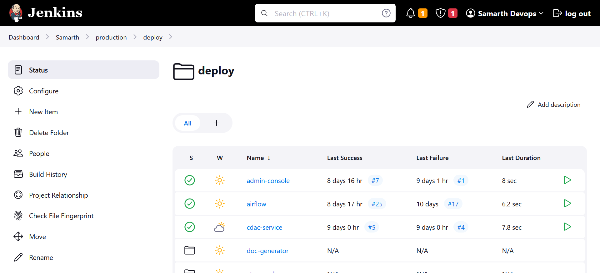

## Repo 📦

All the code related to Samarth deployment can be accessed through https://github.com/Samarth-HP/samarth-devops/. This repository encompasses all the essential components required for deploying the `Samarth` system.

## Directory Structure 📃

| Files/Directories     |
| --------------------- |
| ansible_workspace_dir |
| docker-compose        |
| docs                  |
| hasura                |
| jenkins-jobs          |
| scripts               |
| Jenkinsfile           |

- **ansible_workspace_dir**

  This directory serves as the working space for `ansible`, containing all the necessary roles and services for deployment via `ansible`.

- **docker-compose**

  In this directory, you'll find Dockerfiles/docker-compose files for databases/services, both for the `eSamwad` backend and the [cross-cutting services](./current-infra.md#overview-of-cross-cutting-services), along with some standalone services.

- **docs**

  The `docs` directory houses comprehensive documentation pertaining to various aspects of the `Samarth` deployment.

- **hasura**

  This directory holds `Hasura` metadata & migrations, a crucial component as we heavily rely on Hasura for certain database operations. See [here](./db-setup.md#hasura-metadata) for how you can apply hasura metadata and migrations.

- **jenkins-jobs**

  Within this directory, you'll discover Jenkins jobs tailored for `Samarth` — both for development and production. Jenkins can directly access these jobs to create pipelines, streamlining the deployment process.

- **scripts**

  The `scripts` directory contains a collection of generic scripts designed to automate various tasks.

- **Jenkinsfile**

  This file provides a sample `Jenkinsfile` template for onboarding new services into the Jenkins pipeline.

This well-organized structure simplifies the management and deployment of `Samarth`, ensuring a streamlined and efficient DevOps process.

## Infrastructure Setup 🏗️

For a comprehensive understanding of the infrastructure we're working with, you can refer to [this documentation](./current-infra.md). It provides insight into the servers and services we're managing.

#### Application Server Setup

As outlined in the above documentation, we have an application server dedicated to hosting services that can't be deployed using Docker Swarm or require external accessibility. On this server, we've set up the following services:

- Jenkins
- Vault
- Minio
- Sentry
- Posthog

To configure each of these services, follow these steps:

##### Jenkins

For Jenkins setup, refer to the dedicated documentation available [here](./jenkins-setup.md).

##### Vault

To set up Vault, follow the instructions provided in this dedicated documentation [here](./vault-setup.md).

##### Minio

Starting the Minio service is straightforward. Simply run the following command:

```sh
docker-compose -f /home/samarth-devops/docker-compose/minio-compose.yml up -d
```

Afterward, configure Minio to work with `doc-generator` service. You can find detailed guidance in [this document](./current-infra.md#minio).

##### Sentry

[Here](./current-infra.md#sentry) is a comprehensive section on how you can setup Sentry.

##### Posthog

[Here](./current-infra.md#posthog) is a comprehensive section on how you can setup Posthog.

#### Setup on db1 Server

Details about the **db1** server can be found [here](./current-infra.md#db1-server-). This server houses the persistence layer of the `esamwad-backend`. To set it up, execute this command:

```sh
docker-compose -f /home/samarth-devops/docker-compose/db-compose-esamwad-be.yml up -d
```

#### Setup on db2 Server

More information about the **db2** server is available [here](./current-infra.md#db2-server-). This server is dedicated to the persistence layer of cross-cutting services. To set it up, use this command:

```sh
docker-compose -f /home/samarth-devops/docker-compose/db-compose.yml up -d
```

#### Setup on Swarm-Master Server

For setting up Docker Swarm on your `master` node, refer to this detailed guide [here](./docker-swarm-setup.md).

#### Setup on Swarm-Nodes (swarm-node2, swarm-node3)

To configure `worker` nodes, follow the instructions provided in this [guide](./docker-swarm-setup.md#4-add-swarm-worker-nodes).

This infrastructure setup ensures that our Samarth deployment environment is ready to host and manage various services effectively.

## Configure Jenkins ⚙️

Visit the `Jenkins` UI to begin the configuration process.

Upon logging in, you will be directed to the Jenkins dashboard, which should look like this:



The following three essential configurations are required:

1. Add `vault` credentials
   Set this on global level so that jenkins could pull environment variables from there.

   - Go to the /manage/configure page.
   - Under the "Global properties" section, enable 'Environment variables'.
   - Add the following two variables:
     - VAULT_ADDR
     - VAULT_TOKEN

   

2. Add `docker registry` url to publish build images.

   - Configure the docker_server variable at the project level (Samarth). This setting allows Jenkins to publish build images to the specified Docker registry.

   - Navigate to the "Credentials" section under the "Samarth" project in the sidebar.

   

   - Add a credential of type Secret text with:
     - ID = `docker_server`
     - Secret = `<URL of the private Docker registry>`

   We are setting this at project level because we could have multiple projects and we may want different private repository for different projects.

3. Add `github` username and password to the jenkins.

   - Some of our GitHub repositories are private, so Jenkins requires access to them. You need to provide your GitHub username and password for authentication.

   - Within the "Samarth" project, navigate to the "Credentials" section under "production/build" in the sidebar.

   - Open the existing credential under "Samarth » production » build" or add a new one:
     

   

   - Then, for each application listed in the "build" folder, select the credential you've just created. This ensures that each application can use the appropriate credential to access the respective GitHub repository.

   

   

By completing these configurations, you'll enable Jenkins to operate seamlessly within the Samarth deployment pipeline, ensuring the smooth execution of your projects.

## How It Works 🪛


Jenkins automatically loads jobs from `/home/samarth-devops/jenkins-jobs`.

We have a project named `Samarth` where we've organized all the jobs.

The pipelines are categorized into two main sections:

- **Development** (currently not in use)
- **Production**



Within the production section, we have two pipelines:

- **Build**
- **Deploy**

Under the **Build** pipeline, you'll find a list of all the applications that can be built.


We use a multi-branch pipeline, which means we can build images from any branch or even from a pull request.



In the **Deploy** pipeline, you'll see a list of projects that can be deployed. Not all services require a build; some can be directly pulled from Docker Hub and deployed. The deploy pipeline utilizes `Ansible` roles located in `/home/samarth-devops/ansible_workspace_dir`.



When you hit the "Run" button, it triggers the corresponding `Ansible` role, and `Ansible` takes care of deploying the service on the `swarm-master`. The `swarm-master` then manages the deployment across the worker nodes.

## Miscellaneous 😖

Here are some additional resources for managing and expanding the Samarth deployment:

- **Backup and Restore**: Learn how to take backups and perform restores of the database. Check out the guide [here](./db-setup.md#backup--restore-existing-prod-schema--db).

- **Onboarding New Services**: If you want to add a new service to this deployment stack, follow the step-by-step guide provided [here](./service-onboarding.md).
