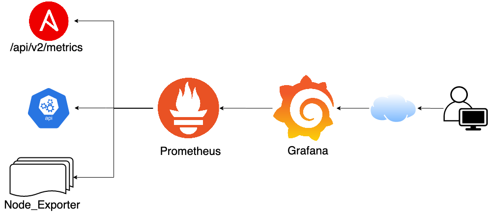
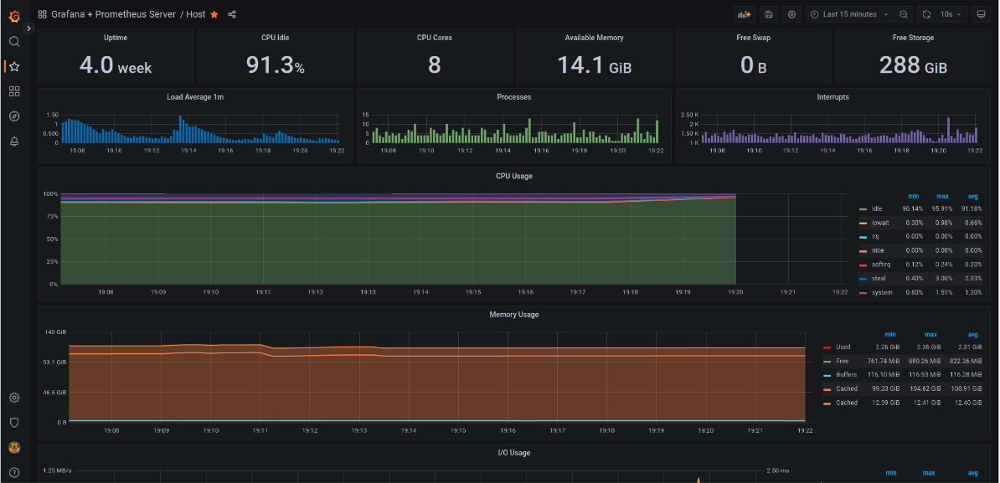
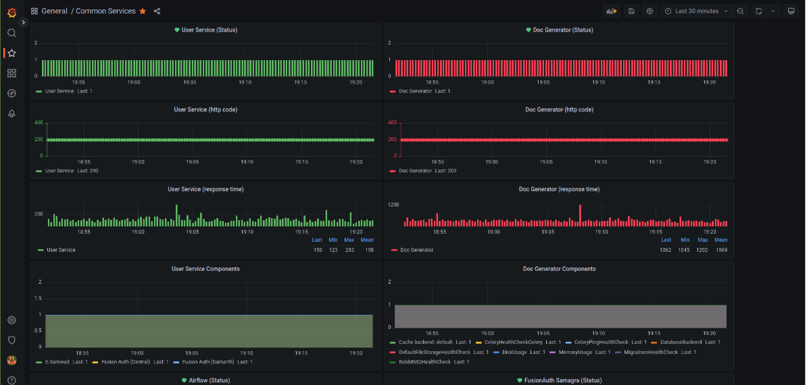
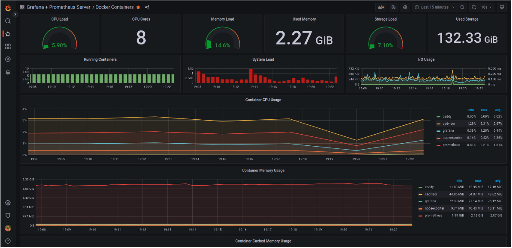

## Need

Monitoring a deployed system in production is an extremely important step.

Lack of monitoring leads to the below issues:

* Deployed services & servers become black boxes
* Systems can go down unexpectedly
* Wait for users to inform about failures
* Engineers / PMs are escalated to fix issues reactively
* Constant firefighting
* Pattern identification is super tough

With monitoring to following advantages are seen:

* Deployed systems & servers are monitored actively & automatically
* Systems going down trigger alerts
* System health degradation can help proactively fix issues
* With a stabler proactively fixed system we can actively work on features
* Patterns are identified quickly

Our top goals to setup monitoring for the Samarth systems are:

* Identify performance of backend systems
* Setup alerting when a system is degrading or offline

## Implementation

Monitoring & alerting for Samarth system is powered by a Grafana + Prometheus system. Grafana and
prometheus are industry standards when it comes to production deployment monitoring and alerting. We
chose them as they are open source and can be self hosted, which both are important requirements.

### Monitoring

[Image Source](https://www.ansible.com/blog/red-hat-ansible-tower-monitoring-using-prometheus-node-exporter-grafana)

#### Host Monitoring

Here we monitor the server processes, load average, uptime, storage, etc..

#### Services Monitoring

Here we monitor the service response times, uptimes and load.

#### Load Monitoring

Here we monitor the load on the host. We use it extensively to see which service / container is
consuming how much memory. It helps in identifying unnatural peaks in traffic.

## Alerting

We have setup alerting to let us know when:

* A system is above 80% load
* A system is low on memory
* Response times are above a threshold
* A container is offline / killed

These alerts are linked to our communication channels where devs can proactively check and fix
issues rather than having to monitor the grafana dashboard constantly.z

## Benefits

Monitoring has helped us identify some excessive load issues and proactively fix issues before the
system goes down completely. It has also helped us identify large response times from services which
we can fix proactively. 