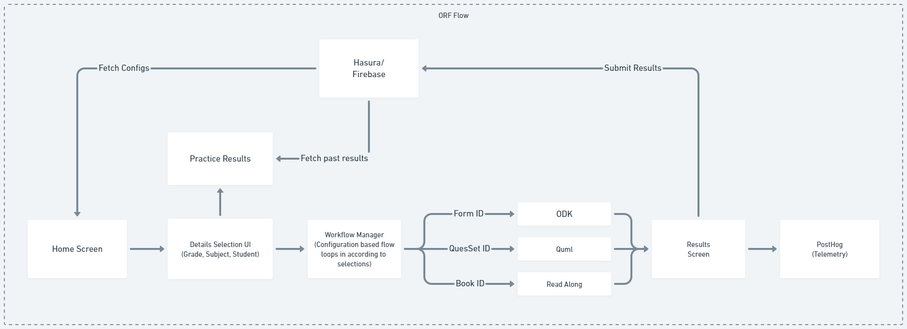
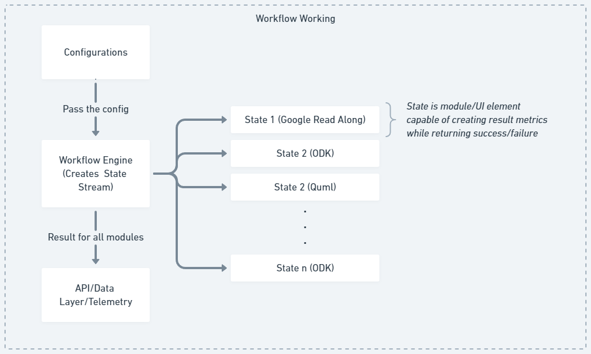
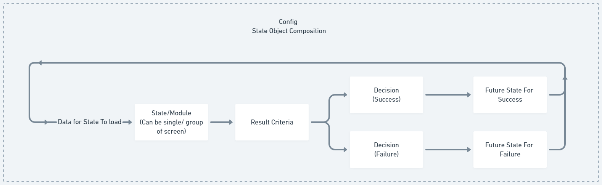
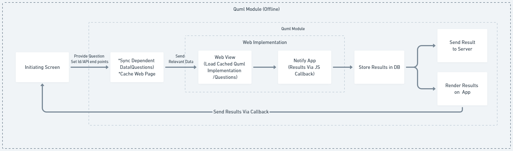
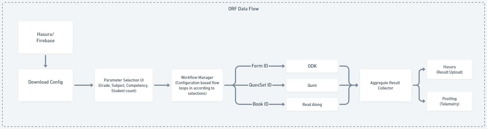
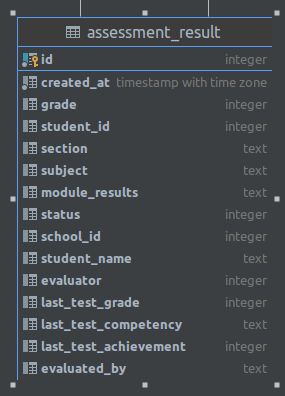

The ORF (Oral Reading Fluency) Practice module in the application aims to improve students' reading fluency. The module provides a structured practice plan and utilizes the Readalong and Quml workflows to assess and enhance students' ORF skills. Here is a detailed description of the ORF Practice module:

 
[ORF Flow](https://whimsical.com/orf-Bbe7zrLBjMVNzWwvvew1n6) 

### Landing Page and Configuration
- The module begins with a landing page where teachers input student information, including grades, sections, subjects, and student details.
- The configuration for allowed grades and subjects is fetched from Firebase Remote Config, making the module easily adaptable.
### Workflow Manager and States:
- The ORF Practice module operates using a built-in Workflow Manager that manages different practice states for each student.
- Each state runs sequentially and provides a callback with either success or failure results.
- The Workflow Manager loops through all states until they are executed, and it returns an array of results to the class that initiated the workflow.

 
[Workflow Working](https://whimsical.com/workflow-working-Y7K8SoDQ6efWZrnJrcusMp) 

[Workflow State Lifecycle](https://whimsical.com/workflow-state-flow-CL1ai2xf2mcMEBRGSJPdXn) 

### Combination-Specific Configurations
- Configurations for different combinations of grades and subjects are downloaded in advance and stored in preferences from Firebase Remote Config.
- Each combination has a set of states associated with it, and the Workflow Manager loads the appropriate states based on the chosen combination.

### Workflow States:
- **Readalong State**:
    - The Readalong state begins by checking whether the Readalong app is installed on the device. If not, the module guides the teacher through the setup process, displaying a tutorial link for installation.
    - Once the Readalong app is correctly set up, the module redirects the teacher to the Readalong-based reading test.
    - During the test, the student reads a selected passage aloud, and the Readalong app records the reading speed and accuracy.
    - The Readalong app returns the results to the module, including the total number of correct words read and the time taken to complete the reading.
    - Based on predefined criteria for being "nipun" (proficient), the state is marked as a success or failure.
- **Quml State**:
    - In this state, the module receives a question set ID and downloads corresponding questions from the Diksha server.
    - The module opens a web view with a cached offline-enabled version of the Quml player, which runs the questions and collects results via JavaScript interfacing.
    - The results are processed, and the state is marked as a success or failure based on the nipun criteria.

[Workflow State Lifecycle](https://whimsical.com/quml-6Ce4vpJGyoHJmeUqtYoeoh) 

### Final Result Screen and Data Submission
- After completing the workflow, the class that initiated the workflow receives the states from the Workflow Manager.
- The class renders the final result screen, displaying whether the student is nipun or not nipun based on the success or failure of the states.
- The results are pushed to the Hasura server via GraphQL APIs for record-keeping and analysis.

[Workflow State Lifecycle](https://whimsical.com/orf-data-flow-Eo7XX9Gd6gCGKUP1evUwR5)

### Practice Results History
- The landing page of the ORF module also offers an option to view the practice results history of students.
- Teachers can select a combination of grade and section, and the module calls Hasura to fetch results for that combination.
- The practice results history screen displays the grade's practice results for each student, showing the latest practice flow for each.

**The ORF Practice module efficiently uses the Workflow Manager and combines the Readalong and Quml workflows to provide tailored practice plans for students' ORF improvement. The module enables teachers to monitor and track students' progress effectively.**

### Hasura Schema

