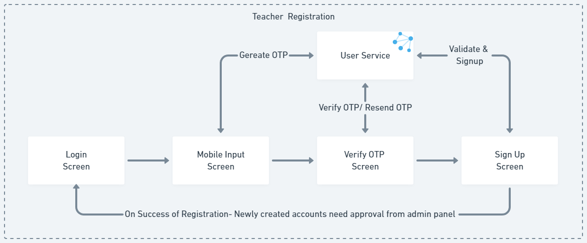

The registration flow in the e-Samwad application allows users to create a new account if one has not already been created by the department. This flow involves mobile number verification via OTP and the submission of a form with relevant personal and teaching information. Upon successful submission, the status of the newly created account becomes pending, as it requires approval from the admin or school head through the admin console.

- User verifies their mobile number with a one-time password (OTP).
- User fills out the registration form with required details.
- Form validations ensure accuracy and completeness.
- User submits the registration form.
- The account status becomes pending for admin/school head approval.
- The registration is reviewed and approved/rejected.
- Approved users receive confirmation and can log in with created credentials.
- If rejected, the user receives an update with the reason for the rejection, and they may need contact the admin for further assistance.

[Regitration Flow](https://whimsical.com/registration-Xa1Nen5oWT7rfrEVzEgJnT)
