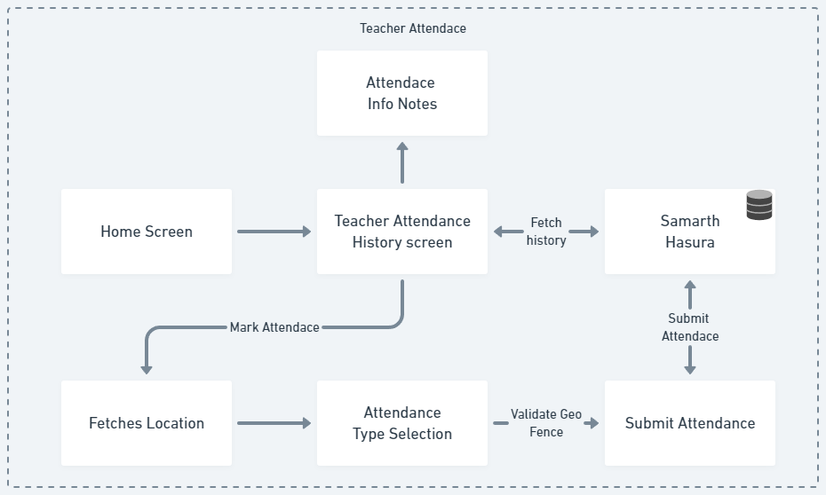
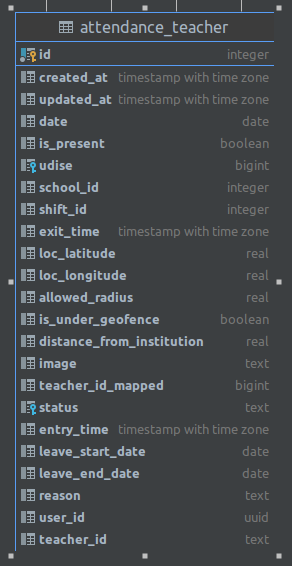

The teacher attendance module application enables teachers to mark their own attendance. The module is flexible and configurable, fetching certain parameters from Firebase Remote Config. Here is a detailed description of the flow within the teacher attendance module:

### Teacher Attendance History
- Upon accessing the teacher attendance screen, teachers can view their attendance history listed according to dates.
- The attendance history is fetched from Hasura through GraphQL API, based on specific filters.
### Configuration and Geo-fencing
- The teacher attendance module relies on configuration settings obtained from Firebase Remote Config.
- The configuration determines the display and functionality of the teacher attendance screen.
- To mark attendance, the teacher must be within a geo-fence area around or within the school premises.
- The geofence distance is configurable through the remote config parameters.
### Marking Attendance
- When inside the geo-fence area, the teacher proceeds to mark their attendance.
- The module prompts the teacher to select the type of attendance, such as on-field, half-day, etc., based on the configuration settings.
- After selecting the type of attendance, the app verifies the geo-fence using the previously fetched location data.
- If all conditions are met, the teacher's attendance is marked accordingly.
### Offline Capability
- The teacher attendance module is offline capable, allowing teachers to mark their attendance even without an internet connection.
- The attendance records are saved locally in the Realm database to ensure data availability.
### Attendance Type Information
- The teacher attendance screen includes an info button that provides a list of all the available attendance types.
- This information helps teachers understand and choose the appropriate attendance type.

[Teacher Attendance](https://whimsical.com/teacher-attendace-zeJuoRbxnbJESfMBFWs5T)

### Hasura Schema

