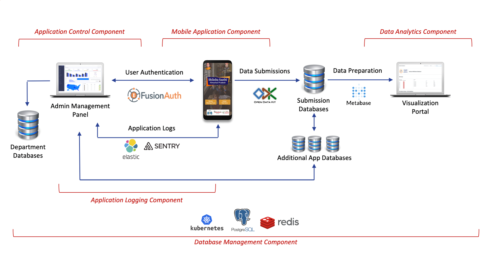

## Overview
The Shiksha Saathi Mobile Application is a pioneering initiative developed by Samagra Shiksha to revolutionize the way school monitoring and data collection are conducted across Himachal Pradesh. Launched in April 2020, this application serves as a digital platform for recording and analyzing monthly school visits conducted by various stakeholders at different levels. It facilitates evidence-based decision-making and enables swift action to address issues identified in schools. Shiksha Saathi has become the primary tool for over 1,000 monitors engaged in school monitoring activities.

### Purpose
The primary purpose of the Shiksha Saathi Mobile Application is to establish a robust and transparent mechanism for monitoring, data collection, and problem-solving in the education sector of Himachal Pradesh. The app aims to modernize and streamline the traditional methods of school monitoring, which often lacked efficiency and accuracy. By leveraging digital tools, real-time data capture, geolocation marking, and evidence collection through pictures, the application empowers stakeholders to make informed decisions and take timely actions.

### Scope
The Shiksha Saathi Mobile Application's scope extends across the entire education administration landscape of Himachal Pradesh. It covers various aspects, including monthly school visits, evidence collection, real-time data capture, geolocation marking, and data analytics. The application's capabilities encompass recording and analyzing visits by multiple stakeholders, aggregating data to identify systemic issues, facilitating district- and state-level review meetings, and enabling accountability mechanisms at different bureaucratic levels. It serves as a comprehensive solution to enhance education quality and administration efficiency.

### Target Audience
The Shiksha Saathi Mobile Application is designed to cater to a diverse range of stakeholders involved in education administration in Himachal Pradesh. The primary target audience includes:

**Monitors and Inspectors:** Over 1,000 monitors responsible for conducting monthly school visits and gathering data using the application.

**Administrative Officials:** Block officials and officers at district and state levels who use the application for data collection, analysis, and decision-making.

**Education Administrators:** Individuals responsible for overseeing education administration, policy implementation, and quality improvement.

**Policy Makers:** Government officials and policymakers who rely on the application's data insights to formulate and refine education policies.

**School Staff:** Teachers and principals who are part of the education system and contribute to the data collection process.

**Data Analysts:** Professionals who utilize the application's data analytics component to derive insights and identify trends.

The Shiksha Saathi Mobile Application is a comprehensive tool that fosters collaboration, transparency, and efficiency among these diverse stakeholders, leading to improved education quality and administration in Himachal Pradesh. 

Here is the component driven architecture of the complete concept

