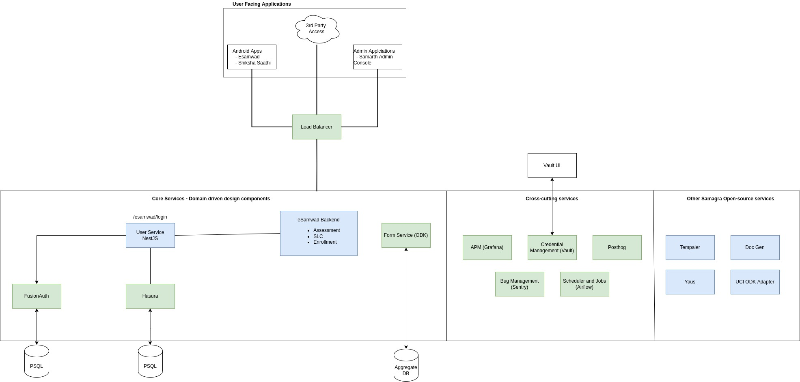
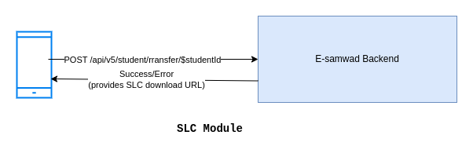

{
Go into details of each service
Create diagram of their interaction
Database structure
}

## Introduction

The backend system consists of mainly the REST APIs written in Python Django framework to power
Esamwad, Shiksha Saathi & NLA for Parents Application. It internally uses User Service, Yaus,
Doc Generator, Templator, ODK Aggregate, etc. as the core building blocks (open source & built
by Samagra). It also uses various open source 3rd party tools like Hasura, Posthog, Sentry, Fusion
Auth, Grafana, Vault, Airflow etc.

A brief overview of all the services is shown below:

## Repos

- Esamwad Backend: https://github.com/Samarth-HP/esamwad-backend
- User Service: https://github.com/Samagra-Development/user-service
- Yaus: https://github.com/Samagra-Development/yaus
- Doc Generator: https://github.com/Samagra-Development/Doc-Generator
- Templater: https://github.com/Samagra-Development/templater
- ODK: https://github.com/samagra-comms/odk
- ODK UCI Adapter: https://github.com/Samarth-HP/odk-uci-adapter
- Posthog: https://github.com/Samagra-Development/posthog-deploy
- Airflow: https://github.com/Samagra-Development/airflow

## Important modules

- Assessment Module
- Student Enrollment Module
- SLC Module
- SMS Module

## Implementation

### Assessment Module

There are 4 types of assessments:

- LO(Learning objective)
- Unit
- Question
- None

And each assessment can be evaluated based on 4 types of evaluation parameters on which we assess students' submissions:

- Grade
- Marks
- Percentage
- None

The final submission results can be evaluated based on 3 outcomes:

- TSP(Total Studnet Passing)
- Boolean
- Marks

There are a total of 32 possible combinations from the above divisions and out of those assessments, we support the Grade and Marks evaluation parameter, LO, Unit, Questions, and None assessment type, and TSP outcome.

#### Assessment Creation

An assessment creation starts by filling out an Enketo form http://139.59.94.126:8005/::bS6kWwto, which on submission to ODK Aggregate returns an XML. This XML is fed to parseForm API (POST /api/v4/form/submit) which actually creates an assessment for the combination in our main Postgres Database.

The backend maintains two levels of caching: one in Redis, which is extremely fast and the other one is the database (which is not comparatively fast) that acts as a fallback mechanism in case Redis isn’t available. On each CRUD operation, we clear the cache at both levels.

#### Assessment Listing

When the user opens the homepage of the E-samwad Android app it hits the getAllAssessments API (GET /api/v5/assessment/all/) for fetching all the assessments available for the school along with their submissions using getStudentSubmissionData API (GET /api/v5/assessment/submission/student/) and getClassSubmissionData API (GET /api/v5/assessment/submission/class/).

User requests go to the backend then the backend finds data in the Redis cache if it didn’t find there then it goes to the Database cache if still assessments are not present there then at last it pulls from the database. There is one more level of cache present which is at the Android level (E-tag) where if data has not been changed at the backend then it uses the same data as it is which reduces our network calls.

#### Assessment Submissions

When the teacher fills in the marks for the assessment then from the Android we hit saveStudentSubmission API (POST /api/v5/assessment/submission/student/) if it was a student-level assessment or saveClassSubmission API (POST /api/v5/assessment/submission/class/) if it was a class-level assessment. After successful submission, the cache gets automatically refreshed for the given assessment when further API calls.

### Student Enrollment Module

This module has 2 parts:

1. New Student Registration: when a student enrolled as entirely new student.
2. School Transfer (within State): when a student is transferred from another school within the state.
3. School Transfer (Other States): when a student is transferred from a school from other state.

### SLC Module

App requests to remove student from the school. Backend generates an School Leaving
Certificate along with a QR code, which can then be used to transfer student within
the state under **Student Enrollment Module**.

### SMS Module

SMS Module is responsible for sending SMS to parents for various events e.g.

- School Holidays
- Parents Meeting
- Exam Announcement
- Result Announcement
- Homework

Form templates are stored on ODK server. Application fetches forms from ODK
and teachers can choose to send SMS from the list of templates.
When the form is submitted, an insertion is made into Hasura table, which then
triggers a webhook to **SMS Adapter Nest Application**.
The **Nest Application** is responsible for:

1. Receiving Requests & queue them.
2. Workers then picks the jobs in a sequential manner.
3. Based on template & business logic, receiver's information is grabbed from
   Esamwad Database.
4. Finally, SMS are sent to CDAC Service provider, which then actually delivers the SMSes.

Nest Application also keeps a track on the progress of the queued jobs & SMS sending failures.

A high level diagram of the flow is shown below:

