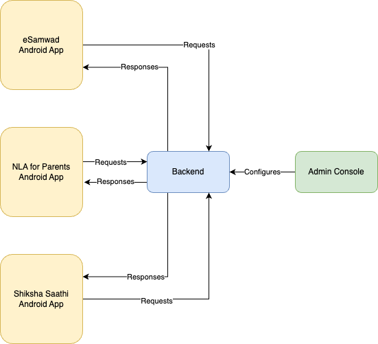

The Samarth systems consists of:
* 3 frontend systems as Android apps
* A singular backend to serve both frontends
* A singular admin console to configure the backend's behavior for the frontends.

Above diagram defines how the different elements work together. 

All the repos can be found on github here: https://github.com/Samarth-HP

Next we shall go into the detail of the implementation of each layer. 